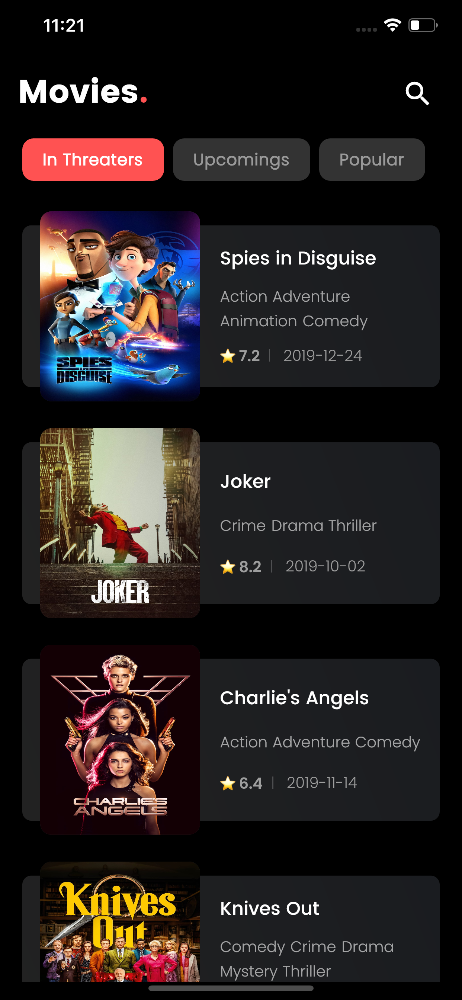
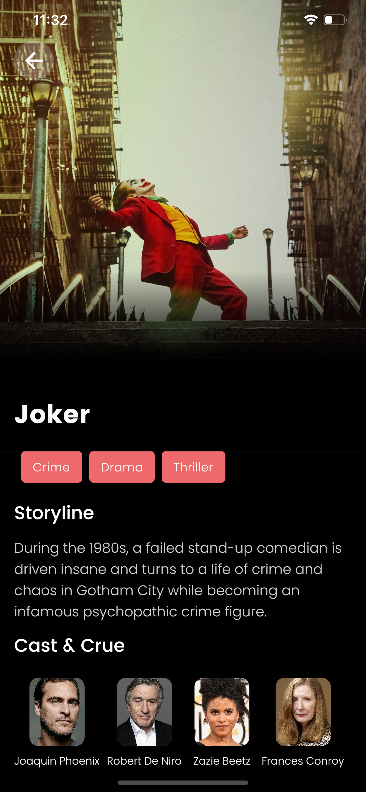
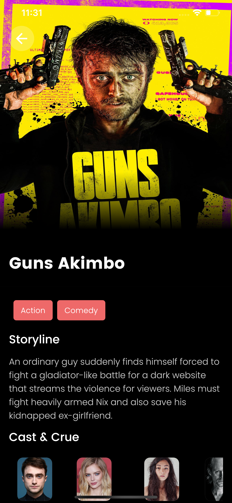
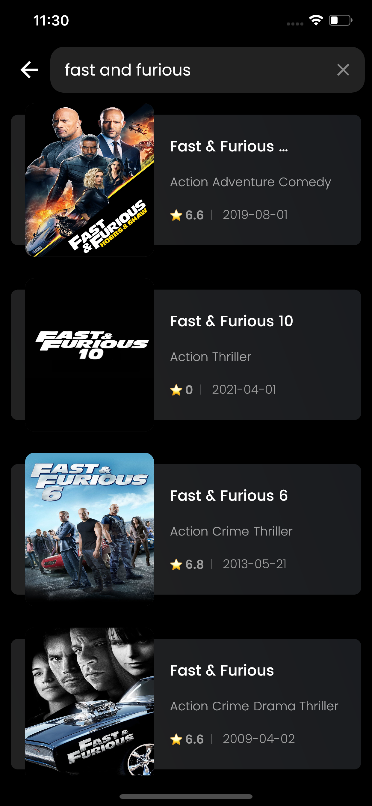
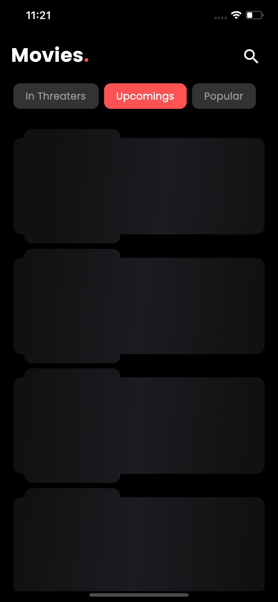

# MOVIES.
## Movie Rating app with flutter Bloc patten

### Instruction
Replace the api_key field with your own key, for key visit [themoviedb.org](https://themoviedb.org) and create your id.

```dart
    final String api_key = "YOUR_KEY";
```
### App Demo
[Download APK file](https://drive.google.com/open?id=1Is-s5QfunIesJIQMqOz1OYqRRFoThPgO)

### Screenshots
<table style={border:"none"}><tr><td></td><td></td><td></td><td></td><td></td><td></td></tr></table>

### Other Apps
[BMI Calculator](https://github.com/imSanjaySoni/BMI-Calculator-with-flutter) 
[Music Flutter Web UI](https://github.com/imSanjaySoni/Flutter-web-Music-UI)

### Follow me.
 -  [Linkedin](https://linkedin.com/in/imsanjaysoni)
-   [Instagram ](https://instagram.com/imsanjaysoni)
-  [Facebook ](https://fb.com/imsanjaysoni)

